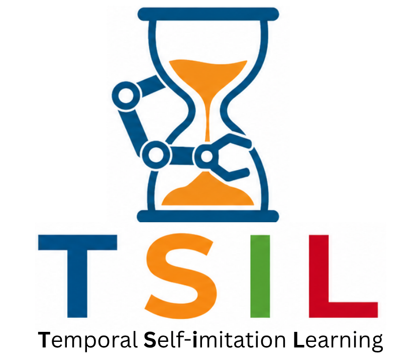
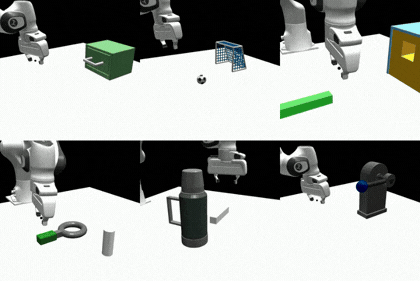
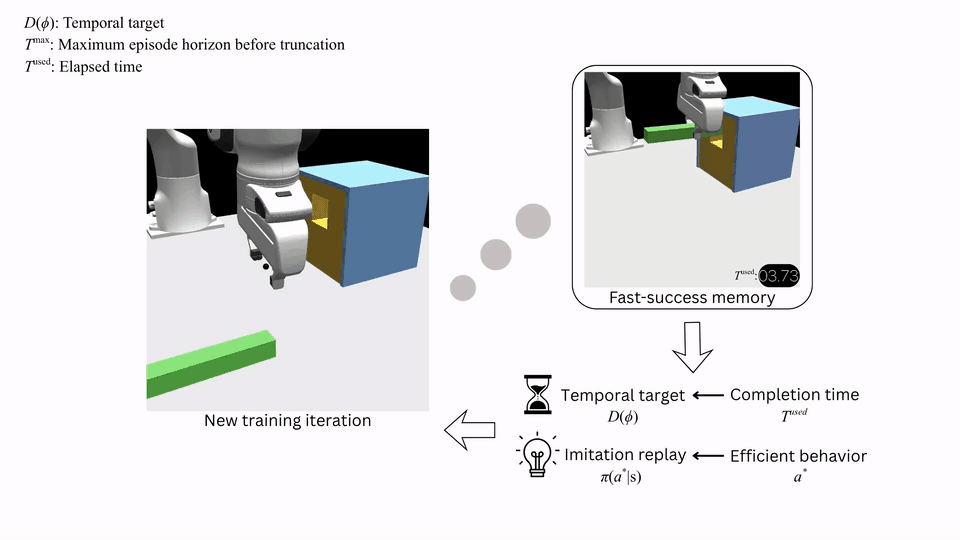

<p align="center">
  
</p>

<p align="center">
  <a href="LICENSE"></a>
  <a href="https://colab.research.google.com/github/generalroboticslab/TSIL/blob/main/notebooks/TSIL_demo.ipynb"></a>
  <a href="https://www.youtube.com/watch?v=Nng0trpbqW8"></a>
  <a href="https://arxiv.org/abs/2606.19752"></a>
  <a href="https://generalroboticslab.com/TSIL"></a>
</p>

## Temporal Self-Imitation Learning (TSIL)

<div>
  

  <p>
    Temporal Self-Imitation Learning (TSIL) is a reinforcement learning framework that uses fast successful trajectories as self-supervision for long-horizon robot manipulation. By deriving adaptive temporal targets and replaying efficient behaviors, TSIL helps policies mitigate reward over-exploitation, reuse rare fast-success memories, and improve task-completion efficiency.
  </p>

  <p>
    This release includes the core TSIL code, plotting scripts, a bundled Isaac Gym + MTBench environment subset, and a lightweight notebook demo.
  </p>
</div>

## 5-minute Mini Demo
The fastest way to understand TSIL is through the mini demo:

- Open in Colab:
  [notebooks/TSIL_demo.ipynb](https://colab.research.google.com/github/generalroboticslab/TSIL/blob/main/notebooks/TSIL_demo.ipynb)
- Read in GitHub:
  [notebooks/TSIL_demo.ipynb](notebooks/TSIL_demo.ipynb)

The demo uses a tiny maze to show how fast rollout successes can become self-supervisory signals. It then illustrates how these signals, adaptive temporal targets and fast-success replay, change learning behavior before scaling to long-horizon manipulation tasks.


## Method Intuition
TSIL is based on a simple idea: a fast successful trajectory shows not only which actions worked, but also how quickly a task configuration can be solved. TSIL turns these fast successes into two complementary learning signals for future policy improvement:

- **Adaptive temporal targets:** fast successes update the target completion time for similar task configurations, encouraging increasingly efficient solutions.
- **Fast-success self-imitation:** efficient successful trajectories are replayed with efficiency-weighted supervision, helping the policy revisit useful behaviors that may otherwise be forgotten.

Together, these signals help reduce reward over-exploitation, preserve efficient behaviors discovered during training, and improve task-completion efficiency.

<p align="center">
  
</p>

## Reproduce Paper Experiments
### Quick Start
Create the Python environment from the provided Conda file:

```bash
conda env create -f tsil.yml
source "$(conda info --base)/etc/profile.d/conda.sh"
conda activate tsil
```

This public branch keeps Isaac Gym Preview 4 under `isaacgym/`, so install the
bundled Python package directly inside the `tsil` environment:

```bash
pip install -e ./isaacgym/python
pip install -e ./MTBench
```
If using a separate Isaac Gym download instead, install that package from the
official NVIDIA Isaac Gym download:
https://developer.nvidia.com/isaac-gym/download.

`MTBench` exposes the local `isaacgymenvs` package used by TSIL training and
evaluation.

Run commands from the repository root. The following environment variables make
the repo-local packages take precedence, expose Isaac Gym shared libraries, and
put generated extension/plotting caches in writable locations to avoid setup
warnings:

```bash
export PYTHONPATH="$(pwd):$(pwd)/MTBench:$(pwd)/isaacgym/python:${PYTHONPATH:-}"
export LD_LIBRARY_PATH="${CONDA_PREFIX}/lib:${LD_LIBRARY_PATH:-}"
export TORCH_EXTENSIONS_DIR="${TORCH_EXTENSIONS_DIR:-/tmp/tsil_torch_extensions}"
export MPLCONFIGDIR="${MPLCONFIGDIR:-/tmp/tsil_matplotlib}"
```

Before launching a GPU training job, verify that the public command surface
loads correctly:

```bash
python -B exec/TSIL/train/launcher.py --help
python -B -m projects.TSIL.eval --help
python -B -m projects.TSIL.plot --help
```

Then run a single-task dry run. This writes only Hydra command metadata and does
not start Isaac Gym simulation:

```bash
N_JOBS=1 TASK_IDS=28 SCRIPT_TIME=readme_smoke \
  bash exec/TSIL/train/entrypoints/mt01/compare_temporal/scratch/all.sh \
  dry_run=true \
  method/temporal=ih \
  seed=42 \
  hydra.sweep.dir=/tmp/tsil_hydra_readme_smoke \
  hydra.run.dir=/tmp/tsil_hydra_readme_smoke_run
```

For a tiny GPU sanity run, remove `dry_run=true` and keep the override small:

```bash
N_JOBS=1 TASK_IDS=28 SCRIPT_TIME=readme_gpu_smoke \
  bash exec/TSIL/train/entrypoints/mt01/compare_temporal/scratch/all.sh \
  method/temporal=ih \
  seed=42 \
  +force_args.total_iters=1 \
  +force_args.num_envs=512 \
  '+force_args.task_counts=[512]' \
  +force_args.minibatch_size=512 \
  +force_args.saving=False \
  +force_args.wandb=False
```

### Training
Training is launched through the per-experiment shell scripts under
`exec/TSIL/train/entrypoints`.

`N_JOBS` controls how many Hydra jobs run in parallel on the local machine;
it defaults to `1` for safe public examples. `GPUS` optionally overrides the
launcher GPU list, for example `GPUS=0,1,2,3` or `GPUS='[0,1,2,3]'`. The
launcher trusts this list and does not auto-detect available GPUs, so include
only devices that are visible on the machine. See the Results Layout section
for the saved output directory structure.

Single-task MT01 example:

```bash
# Temporal-target comparison on task 28.
# Methods: IH, D2S-IH, Step-cost IH, FTTL, ATTL.
N_JOBS=1 TASK_IDS=28 \
  bash exec/TSIL/train/entrypoints/mt01/compare_temporal/scratch/all.sh

# TSIL ablation and self-imitation comparison on task 28.
# Methods: ATTL, ATTL+SIL, TSIL.
N_JOBS=1 TASK_IDS=28 \
  bash exec/TSIL/train/entrypoints/mt01/compare_tsil/scratch/all.sh
```

MT15 benchmark training:

```bash
# Temporal-target comparison.
# Methods: IH, D2S-IH, Step-cost IH, FTTL, ATTL.
N_JOBS=8 \
  bash exec/TSIL/train/entrypoints/mt15/compare_temporal/scratch/all.sh

# TSIL ablation and self-imitation comparison.
# Methods: ATTL, ATTL+SIL, TSIL.
N_JOBS=8 \
  bash exec/TSIL/train/entrypoints/mt15/compare_tsil/scratch/all.sh
```

MT15 training-disturbance experiments:

```bash
# Policy-gradient noise robustness.
# Methods: ATTL, ATTL+SIL, TSIL; noise scales 5, 10, 20.
N_JOBS=8 \
  bash exec/TSIL/train/entrypoints/mt15/policy_grad_noise/scratch/all.sh

# Dense-reward dropout robustness.
# Methods: ATTL, ATTL+SIL, TSIL; dropout probabilities 0.4, 0.6, 0.8.
N_JOBS=8 \
  bash exec/TSIL/train/entrypoints/mt15/dense_dropout/scratch/all.sh

# PPO clipping robustness.
# Methods: ATTL, ATTL+SIL, TSIL; clip coefficients 0.3, 0.5, 0.7.
N_JOBS=8 \
  bash exec/TSIL/train/entrypoints/mt15/sweep_clip/scratch/all.sh

# Learning-rate robustness.
# Methods: ATTL, ATTL+SIL, TSIL; learning rates 0.001, 0.005, 0.01.
N_JOBS=8 \
  bash exec/TSIL/train/entrypoints/mt15/sweep_lr/scratch/all.sh
```

MT15 hyperparameter sweeps:

```bash
# Success-reward scale sweep.
N_JOBS=8 \
  bash exec/TSIL/train/entrypoints/mt15/sweep_suc_rew/scratch/all.sh

# TSIL coefficient sweep.
N_JOBS=8 \
  bash exec/TSIL/train/entrypoints/mt15/sweep_tsil_coef/scratch/all.sh
```

Training results are written under `results/TSIL/train_res`.
Weights & Biases logging is off by default; enable it for launcher runs with
`+force_args.wandb=true` if remote experiment tracking is desired.

Naming quick reference:

- `training_stage=scratch` means training a policy from scratch, without loading
  a checkpoint.
- `method/temporal=ih` is the infinite-horizon PPO baseline.
- `method/temporal=fttl` uses fixed temporal targets.
- `method/temporal=attl` uses adaptive temporal targets and is the main temporal
  baseline.
- `method/sil=tsil` enables fast-success trajectory replay.
- `method/sil=sil_trans` uses standard SIL high-return replay.
- `compare_temporal` compares temporal-target baselines; `compare_tsil`
  compares ATTL, ATTL+SIL, and TSIL.
- `sweep_suc_rew` and `sweep_tsil_coef` run the public reward-scale and TSIL
  coefficient sweeps.

### Evaluation

Evaluate a checkpoint for 2000 trials with randomized configurations, then save
the aggregate success and episode-time metrics. Replace `CKPT` with the
checkpoint run name or path. Replace task id `28` if evaluating a different
task. Use `MT01_T<id>` for the
single-task benchmark and `MT15_T<id>` for the MT15 benchmark.

```bash
python -m projects.TSIL.eval \
  --saving \
  --task_name MT01_T28 \
  --checkpoint CKPT \
  --index_episode best_suc_tail \
  --num_envs 2000 \
  --target_episodes 2000 \
  --target_success_eps 2000 \
  --strict_eval \
  --tasks 28 \
  --task_counts 2000
```

For completed training runs, `best_suc_tail` is the recommended checkpoint for
reproducing reported results because it selects the best running success rate
from the final 10% of training. Use `last` as a fallback for short/debug runs
where `best_suc_tail` was not generated.

For qualitative visualization, evaluation also supports Isaac Gym rendering by
adding `--rendering` on a machine with viewer/display support. Rendering many
parallel environments can be slow, so reduce `--num_envs` when inspecting runs
interactively.

Evaluation results are written under `results/TSIL/eval_res`. The saved
`data.csv` includes `success_rate`, `avg_eps_time`, and `std_eps_time`.

### Plot/Table

After the relevant experiments above have finished, the curated figure and
table scripts read training logs from `results/TSIL/train_res` and write paper
artifacts under `results/TSIL/paper_artifacts`. When multiple matching result
folders exist, the wrappers select the latest finished experiment by default.

Generate figures:

```bash
# Group 1: main method results.
BENCHMARK=mt15 bash exec/TSIL/plot/paper/figures/group1_main_method_results.sh --pdf

# Group 2: adaptive temporal-target learning-signal diagnostics.
BENCHMARK=mt15 bash exec/TSIL/plot/paper/figures/group2_adaptive_ddl.sh --pdf

# Group 3: TSIL/SIL diagnostics.
BENCHMARK=mt15 bash exec/TSIL/plot/paper/figures/group3_sil_analysis.sh --pdf

# Group 4: training-disturbance experiment summaries.
BENCHMARK=mt15 bash exec/TSIL/plot/paper/figures/group4_stability.sh --pdf
```

Use `--png` instead of `--pdf` for PNG outputs.

Generate tables:

```bash
# Group 1: main method results.
BENCHMARK=mt15 bash exec/TSIL/plot/paper/tables/group1_main_method_results.sh

# Group 2: adaptive temporal-target learning-signal diagnostics.
BENCHMARK=mt15 bash exec/TSIL/plot/paper/tables/group2_adaptive_ddl.sh

# Group 3: TSIL/SIL diagnostics.
BENCHMARK=mt15 bash exec/TSIL/plot/paper/tables/group3_sil_analysis.sh

# Group 4: training-disturbance experiment summaries.
BENCHMARK=mt15 bash exec/TSIL/plot/paper/tables/group4_stability.sh
```

Append task ids to generate a table for a subset:

```bash
BENCHMARK=mt15 bash exec/TSIL/plot/paper/tables/group1_main_method_results.sh 28 29
```

### Results Layout

```text
results/
└── TSIL/
    ├── train_res/
    │   └── <benchmark>/<experiment>/<training_stage>/<task>/<method>/<script_time>/<run_name>/
    │       ├── checkpoints/
    │       ├── config.json
    │       ├── plot_metrics_history.jsonl
    │       └── trajectories/
    ├── eval_res/
    │   └── <task_name>/
    │       └── <eval_run_name>/
    │           ├── config.json
    │           ├── data.csv
    │           └── trajectories/
    │               └── meta_data.json
    └── paper_artifacts/
        ├── figures/
        │   └── <benchmark>/
        └── tables/
            └── <benchmark>/
```

## Repository Layout

```text
.
├── core/                         # Shared TSIL implementation
│   ├── agents/                   # Policy architecture and observation preprocessing
│   ├── training/                 # PPO rollout, trainer, metrics, logging, and TSIL hooks
│   │   └── algo/tsil/            # TSIL memory, sampling, and replay loss
│   ├── evaluation/               # Evaluation helpers and trajectory replay utilities
│   ├── plotting/                 # Shared plotting/data-loading utilities
│   └── common/                   # Checkpointing, paths, and trajectory archive helpers
├── projects/
│   └── TSIL/                      # Project-specific public entrypoints and analysis code
│       ├── train.py              # Training entrypoint
│       ├── eval.py               # Evaluation entrypoint
│       ├── plot.py               # Plotting entrypoint
│       ├── ckpt_layout.py        # Checkpoint/result path conventions
│       ├── figures/              # Figure builders and plotting helpers
│       ├── reports/              # Table and metric summary builders
│       └── diagnostics/          # Environment-design validation tools
├── exec/
│   └── TSIL/                      # Public shell launchers and Hydra configs
│       ├── train/                # MT01/MT15 training configs and launch scripts
│       ├── eval/                 # Evaluation and replay scripts
│       └── plot/                 # Figure/table wrappers
├── MTBench/                      # Bundled MTBench environment subset
│   ├── assets/                   # Robot and object assets
│   └── isaacgymenvs/             # Manipulation task environments
├── isaacgym/                     # Bundled Isaac Gym Preview 4 package
│   ├── python/                   # Isaac Gym Python package
│   └── licenses/                 # Isaac Gym third-party licenses
├── notebooks/
│   └── TSIL_demo.ipynb           # Mini demo for understanding the TSIL mechanism
├── web_assets/                   # README visual assets
│   ├── tsil_logo.png
│   ├── tsil_highlight.gif
│   └── tsil_method.gif
└── results/
    └── TSIL/                      # Generated train/eval/paper outputs, ignored by Git
```

## License

TSIL code is released under the Apache License, Version 2.0. See
[LICENSE](LICENSE) for the full license text.

Bundled third-party components keep their own license terms:

- **Isaac Gym Preview 4:** included under `isaacgym/`. See
  `isaacgym/python/LICENSE.txt` and the bundled license files under
  `isaacgym/licenses/`.
- **MTBench:** included under `MTBench/`. See `MTBench/LICENSE.txt`.

## Acknowledgements

This work is supported by DARPA TIAMAT program under award HR00112490419, ARO under award W911NF2410405, NSF ERC PreMiEr under award 2133504, and ARL STRONG program under awards W911NF2320182, W911NF2220113, and W911NF242021.

## Citation

Please cite our paper if you find TSIL useful.

```bibtex
@misc{jia2026temporalselfimitationlearning,
      title={Temporal Self-Imitation Learning},
      author={Yinsen Jia and Boyuan Chen},
      year={2026},
      eprint={2606.19752},
      archivePrefix={arXiv},
      primaryClass={cs.RO},
      url={https://arxiv.org/abs/2606.19752},
}
```
